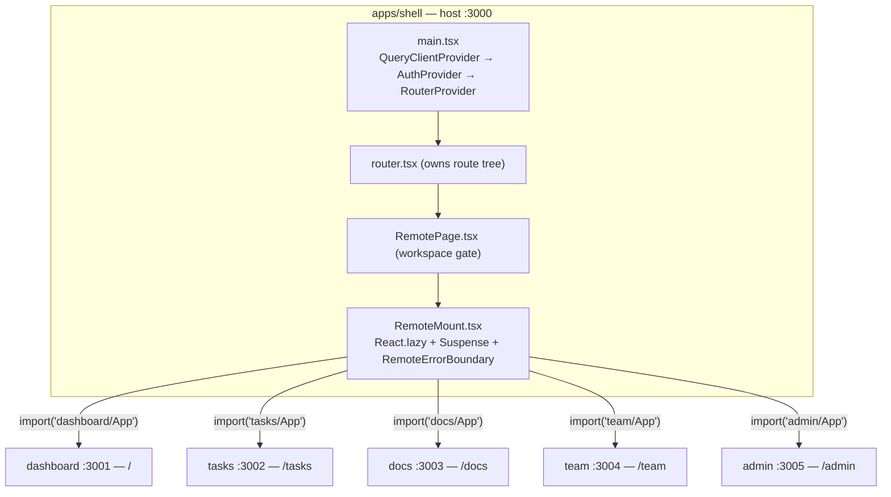
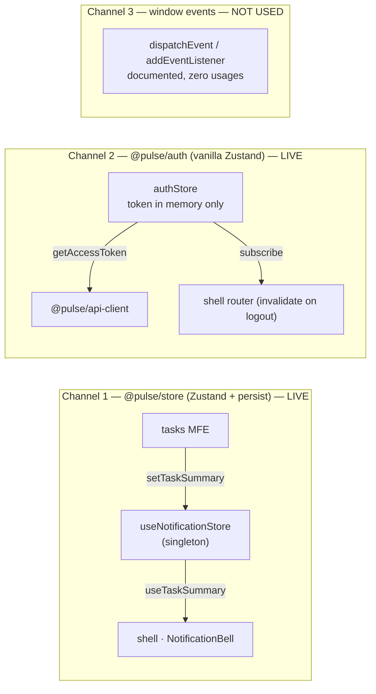
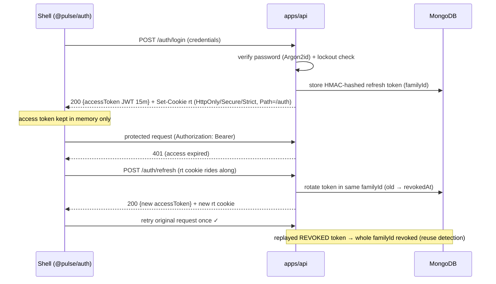

# Architecture

A code-grounded walkthrough of how PulseHQ is structured and how the pieces communicate.
Every claim here is traced from source — see the file references throughout.

> **TL;DR** — PulseHQ is one product to the user, built as a **federated frontend** (a `shell`
> host that loads five remote MFEs at runtime over Module Federation) plus a **REST monolith
> backend** (`apps/api`), all in a single Turborepo. MFEs never import each other; they
> communicate only through **shared federation singletons** (`@pulse/store`, `@pulse/auth`).

---

## 1. The monorepo at a glance

Turborepo + pnpm workspaces. The repo splits in two: the **frontend** is federated at runtime
(the shell composes independently built-and-deployed remotes); the **backend** is a deliberate
monolith (modules separated in code, but one DB, one process, one deploy artifact). Between them
sit `packages/*` — most are frontend-only, three are pure enough to be shared by both sides.

```
apps/
  shell/            # FE host — auth, layout, MFE loader          [frontend]
  dashboard/        # FE remote                                   [frontend]
  tasks/            # FE remote                                   [frontend]
  docs/             # FE remote                                   [frontend]
  team/             # FE remote                                   [frontend]
  admin/            # FE remote                                   [frontend]
  api/              # Express 5 + Mongo REST monolith             [backend]
packages/
  ui/               # React components (Radix + CVA)              [FE only]
  auth/             # client auth provider + in-memory token      [FE only]
  api-client/       # typed fetch wrapper + Zod schemas           [FE only]
  store/            # shared Zustand state (federation singleton) [FE only]
  utils/            # pure functions                              [FE only]
  tailwind-config/  # design tokens preset                        [FE only]
  types/            # domain TS types                             [FE + API]
  tsconfig/         # base TS configs                             [FE + API]
  eslint-config/    # flat ESLint configs                         [FE + API]
```

### Dev ports

| App        | Role     | Port | remoteEntry (dev default)        |
| ---------- | -------- | ---- | -------------------------------- |
| shell      | **host** | 3000 | — (consumer)                     |
| dashboard  | remote   | 3001 | `/assets/remoteEntry.js`         |
| tasks      | remote   | 3002 | `/assets/remoteEntry.js`         |
| docs       | remote   | 3003 | `/assets/remoteEntry.js`         |
| team       | remote   | 3004 | `/assets/remoteEntry.js`         |
| admin      | remote   | 3005 | `/assets/remoteEntry.js`         |
| api        | backend  | 4000 | `/health` · `/auth` · `/workspaces/…` |

---

## 2. Frontend federation topology

The **shell** is the Module Federation host (`@originjs/vite-plugin-federation`). Its
[`apps/shell/vite.config.ts`](../apps/shell/vite.config.ts) declares each remote's `remoteEntry.js`
URL (overridable via `VITE_REMOTE_*` env). Each remote exposes exactly **one** module,
`./App` → `src/bootstrap.tsx`, a thin re-export of its root component that receives a
`{ workspaceId }` prop. **Routing is fully centralized in the shell** — there is no per-MFE route
manifest; remotes are pure view components and inherit all providers from the host tree.



**Shared singletons** (declared on the host, mirrored by remotes) so React context, the auth
store and the query cache are the *same instances* at runtime:

`react` · `react-dom` · `@tanstack/react-query` · `@pulse/auth` · `@pulse/store` · `@pulse/ui`

| Concern    | Detail |
| ---------- | ------ |
| Load path  | `router.tsx` → `RemotePage.tsx` (workspace gate) → `RemoteMount.tsx` (`lazy` + `Suspense`) → `RemoteErrorBoundary.tsx` |
| Isolation  | Each remote is wrapped in its own error boundary. A remote that is offline, mid-deploy, or throws on render shows a contained "Try again" fallback — **the shell and sibling remotes stay up.** |
| Expose     | every remote: `exposes: { "./App": "./src/bootstrap.tsx" }` |

---

## 3. How the MFEs communicate

The golden rule: **never import from one `apps/*` into another.** Because the shared packages are
federation singletons, a Zustand store defined at module scope is literally *one object* shared by
the shell and every remote. That single fact is the whole communication model.



| # | Channel | Mechanism | Persisted? | Status |
| - | ------- | --------- | ---------- | ------ |
| 1 | `@pulse/store` | Zustand + `persist` federation singleton | Yes — `localStorage`: `pulse-theme`, `pulse-workspace`, `pulse-notifications` | **live** |
| 2 | `@pulse/auth`  | vanilla Zustand module singleton | No — access token in memory only | **live** |
| 3 | window events  | `CustomEvent` bus | — | **not used** (replaced by shared-store singletons) |

**Traced example (channel 1):** the `tasks` remote computes `{ todo, inProgress, total }` and calls
`useNotificationStore.setTaskSummary` in [`apps/tasks/src/TasksApp.tsx`](../apps/tasks/src/TasksApp.tsx);
the shell's [`NotificationBell`](../apps/shell/src/components/NotificationBell.tsx) reads
`useTaskSummary()` for the badge. Same store instance, no cross-`apps/*` import.

**Transport underneath:** [`@pulse/api-client`](../packages/api-client/src/client.ts) — one typed
`createClient({ baseUrl, getToken, refresh })` instance, built once by `@pulse/auth` and shared.
Endpoints live in `packages/api-client/src/endpoints/*.ts` with Zod response envelopes; MFEs consume
them through TanStack Query hooks (e.g. [`apps/tasks/src/hooks/useTasks.ts`](../apps/tasks/src/hooks/useTasks.ts)).
Because react-query is itself a shared singleton, the query cache is shared across host and remotes.

**Store API:** `useTheme` (dark-mode class, `pulse-theme`) · `useWorkspaceStore` (active id,
`pulse-workspace`) · `useNotificationStore` / `useTaskSummary` (`pulse-notifications`).

---

## 4. End-to-end auth flow

The access token is a short-lived JWT held only in memory; the refresh token is an opaque,
DB-backed, rotating credential delivered as an `httpOnly` cookie scoped to `/auth`. The whole
401 → refresh → retry dance is hidden inside `@pulse/api-client`.



1. **Login** — `POST /auth/login`. Password verified with **Argon2id** (OWASP params), guarded by
   account lockout (10 fails / 15 min → 15-min lock; generic error either way).
2. **Issue tokens** — Access **JWT** (HS256, 15 min) in the body → memory. Opaque refresh token
   (32 bytes) → `rt` cookie `HttpOnly; Secure; SameSite=Strict; Path=/auth`, stored **HMAC-hashed**
   in `refresh_tokens` with a `familyId`.
3. **Protected calls** — every MFE sends `Authorization: Bearer`. `requireAuth` verifies statelessly
   and accepts any configured secret (zero-downtime key rotation).
4. **Silent refresh** — on a 401, `api-client`'s `doFetch` calls `refresh()` (cookie rides along).
   Concurrent refreshes collapse into a single `inFlight` promise. Server rotates the token **in the
   same family** (old → `revokedAt`), returns a new access token, and the request retries **once**.
5. **Reuse detection** — a replayed *revoked* refresh token (stolen + used after rotation) revokes
   the **entire `familyId`** — every session on every device — and logs `refresh_reuse_detected`.
   Two 401s in a row → client signs out.

> Files: [`apps/api/src/modules/auth/auth.service.ts`](../apps/api/src/modules/auth/auth.service.ts) ·
> `auth.controller.ts` · `lib/{jwt,crypto,cookies}.ts` ·
> [`packages/auth/src/auth-client.ts`](../packages/auth/src/auth-client.ts) · `store.ts` ·
> [`packages/api-client/src/client.ts`](../packages/api-client/src/client.ts)

---

## 5. Backend request lifecycle

Boot is `loadEnv → connectDb → createApp → listen`, with every env var validated by Zod at startup
(fail loud, no defaults for secrets). Every request then flows through a **deliberately ordered**
middleware stack, locked in [`apps/api/src/app.ts`](../apps/api/src/app.ts) — reordering it breaks
correlation IDs, logging, or security.

```
1. trust proxy        correct req.ip behind the LB · disable X-Powered-By
        ↓
2. requestContext     requestId + child logger (before pino, so logs carry it)
        ↓
3. security           helmet · CORS allowlist · hpp · cookie-parser · json 100 kB
        ↓
4. pino-http          one structured JSON line per request
        ↓
5. routes             /health · /auth · /users · /workspaces/:id/…
        ↓
6. 404 handler        unmatched → safe JSON
        ↓
7. error handler      LAST — maps known errors, never leaks (unknown → 500 + requestId)
```

**Guard stack — every tenant resource.** Business resources live under `/workspaces/:workspaceId/…`.
Guards compose in this exact order before the controller runs:

```
requireAuth → requireWorkspace → requireRole(…) → validate({ body, params, query }) → controller → service → model
```

**Tenant isolation is enforced in the query itself**, never as a post-hoc check —
`Task.findOne({ _id, workspaceId })`, so it can't be forgotten. Every tenant collection has a
compound index leading with `workspaceId`. Modules (`auth · users · workspaces · tasks · docs ·
team · admin`) cross only via each other's **services** — never each other's models.
`tasks`/`docs`/`team`/`admin` routers are sub-mounted under `/workspaces/:workspaceId/…`.

---

## 6. Architectural watch items

Two things that are fine today but worth knowing:

- **Shared-list drift.** Only `tasks` mirrors the shell's full shared list. `dashboard`, `docs`,
  `team` and `admin` **omit** `@pulse/store` from their `shared` array. Harmless now (they don't
  import it) — but the day one of them reads `useTheme` or `useWorkspaceStore`, it would get a
  bundled *non-singleton* copy and silently drift out of sync with the shell. Align proactively when
  adding shared-state usage to those remotes.
- **Window-events channel is documented but unimplemented.** The guides list typed `window` events
  as a last-resort cross-MFE signal, but there are zero `CustomEvent`/`dispatchEvent` usages — it's
  fully replaced by shared Zustand singletons. Treat that channel as "not in use."
